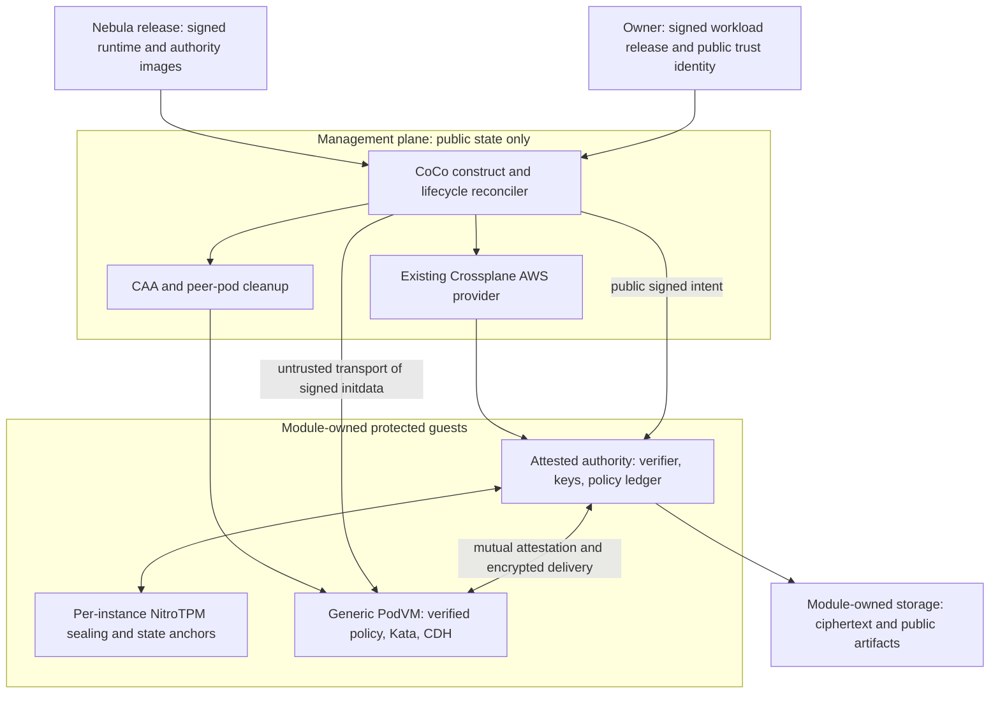

# Self-sufficient AWS CoCo: architecture research

Research date: 6 October 2026. Repository baseline: `78900be`.

Hardware follow-up: [7 October NitroTPM experiments](HARDWARE_QUALIFICATION.md).
The follow-up qualifies specific local mechanics; the release gates below still
require the actual immutable appliances and integrated authority protocol.

**Recommendation, not a shipped implementation:** keep the reusable CoCo
RuntimeClass, distribute generic immutable guest images with each Nebula release,
and let the module provision a small attested authority with instance-bound
sealed state. Authenticate workload policy at guest startup instead of baking a
new AMI for every workload. Keep infrastructure reconciliation outside the key
boundary. Reuse Trustee protocols and Nebula's public signed-release contracts.

This is the most promising architecture for the stated boundary, subject to the
hardware and protocol gates below. It removes the deployment-time trusted
builder, external verifier/KBS installation and manual recovery password from
normal operations. It does **not** establish that the existing prototype is
self-sufficient or production-ready.

## Requirements and necessary distinctions

The deployment experience is one ordinary Nebula declaration and apply. The
module creates its dependencies, qualifies the runtime, handles retries,
restarts, supported replacements and upgrades, and cleans up its resources.
There are no installation scripts, copied measurements, prepared AMIs,
pre-created role ARNs, manually seeded key stores or separately operated trust
services. The existing Nebula AWS provider connection and placement are normal
platform inputs. Provisioning additional resources *inside the module* is allowed.

Management-cluster administrators, worker administrators and cloud-account
operators, including account recovery administrators, must not obtain workload
keys or authorize different code to obtain them. AWS Nitro hardware, firmware,
hypervisor and attestation PKI remain trusted, as in the prototype. Application
owners and the approved software supply chain remain trusted for the code and
policy they authorize. Availability against an administrator deleting resources
is outside this confidentiality boundary.

Two inputs cannot be manufactured by infrastructure automation:

- **Owner intent.** An administrator's manifest edit cannot also be proof that
  the workload owner authorized that edit. Use the owner's existing signed
  application-release artifact as public declarative input. Its private signer
  never enters Nebula synthesis or the management cluster. Signing belongs to
  normal application publication, not a new module setup or completion task.
  An unsigned-only delivery workflow cannot meet this administrator boundary
  without adding an independent authentication source.
- **Pre-existing secrets.** A module can generate its own workload keys, but
  cannot invent an existing customer's encryption key. Import uses an automated,
  owner-authenticated, attested API from the owner's normal publication/client
  flow. No plaintext key is carried through Kubernetes or the controller.

Public trust configuration and software artifacts are necessary inputs, not a
separately operated service. An owner or relying client must know its intended
owner identity and deployment manifest through a trusted path. A public key
supplied only by the same untrusted server does not establish ownership.

## Evidence that changes the earlier design

| Finding | Consequence |
| --- | --- |
| CoCo initdata explicitly supports measuring dynamic configuration into a TPM PCR. | A generic runtime can bind a different exact policy for each workload; per-workload AMIs are not inherently necessary. |
| NitroTPM supports PCR-bound sealing, and its state is excluded from EBS snapshots and VM exports. | An instance-bound recovery root is available without a customer-managed KMS policy. |
| AWS documents an EC2 instance ID in the signed NitroTPM module ID and exposes the instance's endorsement public key through an API. | The earlier blanket claim that there is no documented instance identity was too strong. Instance membership is researchable; account authorization still requires additional checks. |
| An unmanageable KMS key can be recovered through AWS Support with root-account authorization. | Removing all ordinary policy administrators does not make same-account KMS immutable against the full account-recovery adversary. |
| Contrast provides an attested coordinator, signed manifest history and automatic peer recovery. | This is a useful architectural reference, but its documented all-replicas-down recovery and supported platforms do not satisfy this AWS module unchanged. |

Sources: [CoCo initdata specification](https://github.com/confidential-containers/trustee/blob/3b7c99069a7c89ea51713dcf7cf98c16dbe2d3db/kbs/docs/initdata.md),
[NitroTPM sealing](https://docs.aws.amazon.com/AWSEC2/latest/UserGuide/nitrotpm.html),
[NitroTPM state restrictions](https://docs.aws.amazon.com/AWSEC2/latest/UserGuide/enable-nitrotpm-prerequisites.html),
[module ID semantics](https://docs.aws.amazon.com/kms/latest/developerguide/ct-nitro-tpm.html),
[GetInstanceTpmEkPub](https://docs.aws.amazon.com/AWSEC2/latest/APIReference/API_GetInstanceTpmEkPub.html),
[KMS account recovery](https://docs.aws.amazon.com/IAM/latest/UserGuide/id_root-user.html),
and [Contrast coordinator](https://docs.edgeless.systems/contrast/architecture/components/coordinator).

These sources establish building blocks. The sealing, membership and recovery
protocol proposed below is an engineering inference, not an AWS-certified
construction. In particular, snapshot exclusion alone does not prove the
crash-consistent anti-rollback protocol.

## Options considered

| Option | Administrator protection and lifecycle | Decision |
| --- | --- | --- |
| Run the Python preparation and KBS in management Jobs/Pods | Automates commands, but administrators still control approvals and plaintext state. | Reject. |
| Native KMS recipient attestation | Much less custom infrastructure; usable when KMS policy/recovery administrators are trusted. That is a narrower threat model than requested. | Keep as a possible explicit future trust profile, not this profile's root. |
| Nitro Enclaves authority backed by KMS | Strong isolation from the parent; enclaves have no persistent storage. KMS policy ownership remains the recovery trust issue. | No advantage for this boundary over an attestable VM with its own TPM. |
| Contrast coordinator | Closest existing self-contained CoCo architecture. Version 1.24 targets bare-metal SNP/TDX, uses owner recovery when no peer survives, and requires a production license. | Learn from its contracts; not an unchanged AWS CAA backend. |
| Constellation | Protects a whole Kubernetes cluster, with an explicit master-secret recovery flow. | Too broad for an alternative RuntimeClass; does not remove recovery prerequisites unchanged. |
| OpenBao with auto-unseal | Useful general secret management and storage; still needs a correctly protected sealing root and attested admission. | Optional service above the authority, not the bootstrap solution itself. |
| Nitriding-based enclave service | Offers attested service identity and peer synchronization; repository is archived. | Reference only, not the maintained default dependency. |
| Per-deployment attested builder plus authority | Can bind arbitrary generated AMIs, but adds a second protected service and build trust/recovery lifecycle. | Remove from the default architecture. |
| Generic runtime plus TPM-sealed attested authority | Fits the existing AWS/Nitro trust boundary and removes external key infrastructure. Needs new integration and hardware qualification. | Recommended research direction. |

References: [KMS NitroTPM integration](https://docs.aws.amazon.com/kms/latest/developerguide/cryptographic-attestation.html),
[Nitro Enclaves isolation and persistence limits](https://docs.aws.amazon.com/enclaves/latest/user/nitro-enclave-concepts.html),
[Contrast platforms and license](https://docs.edgeless.systems/contrast),
[Constellation recovery](https://docs.edgeless.systems/constellation/2.22/workflows/recovery),
[OpenBao sealing](https://openbao.org/docs/2.5.x/configuration/seal/pkcs11/),
and [nitriding-daemon](https://github.com/brave/nitriding-daemon).

## Recommended component boundaries

### 1. Release-built appliances, not a deployment-time build service

Publish two small immutable artifacts: a PodVM runtime and an authority VM.
They may share the same reproducible base, but have different allowed services
and measured identities. The authority needs no Kata workload execution API.
Pin UKI, root filesystem, binaries, package/repository snapshot and public trust
roots. Ship expected measurements, provenance, digests and supported platform
matrix in a signed release catalog. Do not trust measurements reported by the
first VM that happens to start.

The module imports or copies the released image automatically and obtains the
resulting AMI ID through reconciliation. An untrusted import worker can upload
bytes but cannot approve alternate measurements. Artifact mirrors and image
IDs are locators; the authenticated release measurements establish identity.
Use the same software-distribution trust model as other Nebula components.

AWS's [attestable image build workflow](https://docs.aws.amazon.com/AWSEC2/latest/UserGuide/build-sample-ami.html)
provides an immutable AL2023 base, build-time measurement generation, EBS upload
and AMI registration building blocks. Nebula must supply and qualify the actual
released artifacts; the current staging sources are not those artifacts.

### 2. Public orchestration through existing Nebula patterns

Use Crossplane for ordinary AWS resources and references. A small reconciler
handles the multi-stage operations not expressed by those resources: image
import completion, authority discovery, signed-intent delivery, runtime
qualification, safe rollouts and garbage collection. It must hold no key-release
credential, owner signer, unseal secret or power to approve measurements.

The module owns additional security groups, IAM roles/trust, images/snapshots,
authority instances, state volumes, artifact storage and internal discovery it
creates. It uses the already configured provider identity. It must reconcile any
additional workload-identity federation it needs, rather than asking users to
run a second IRSA bootstrap. Scope credentials separately for CAA, cleanup,
artifact import and read-only authority cloud-identity checks.

Discovery via DNS, Kubernetes status, EC2 tags or endpoints is untrusted.
Attestation decides who is at an endpoint. IAM and security groups reduce
accidents and attack surface; an account administrator's ability to change
them must not grant a secret.

### 3. An attested authority with no Kubernetes secret root

Run the verifier and key service inside the released authority VM. Start with
three persistent instances across three supported availability zones. Spread is
an availability feature; every replica still has access to authority secrets.
This is not threshold cryptography or tolerance of a compromised authority binary.

Generate deployment secrets and service keys inside protected memory. Authenticate
the initial signed intent and commit its owner set, deployment identity, allowed
runtime releases and policy ledger before releasing workload keys. Do not expose
a general administrator endpoint controlled by a Kubernetes Secret. Authorize
updates against the owner identity already committed inside the authority.

The authority presents fresh evidence binding its TLS key, release identity and
deployment context. Guests independently verify that evidence against roots and
expected intent they already trust. Certificates and their rotation are generated
inside the service. A controller-provided TLS CA or endpoint alone is insufficient.
If discovery points to a different valid authority, the deployment identity and
state lineage checks must still reject it.

Initialization must distinguish a new deployment from missing or replayed state.
Bind a fresh deployment identifier, owner set and genesis digest to the generated
authority public identity and all encrypted state. Persist member enrollment in
the protected ledger. Another cluster with the same public descriptor but a new
seed cannot recover the original data and must not be presented as its successor.
Clients retaining continuity need the original authenticated public identity or
an authorized transition from it; trusting mutable discovery is insufficient.

Avoid an additional custom passport issuer as the permanent architecture.
Prefer a NitroTPM evidence adapter in Trustee/guest-components, with KBS and
the embedded attestation service in the protected appliance. Reuse their secret
delivery protocol. At the inspected Trustee commit, the generic TPM verifier
expects preconfigured AK keys and ordinary TPM quotes; it is not the AWS-native
COSE NitroTPM verifier. A dedicated adapter is real missing work, not a flag.
The Python issuer remains a compatibility prototype until that integration exists.
See the [pinned TPM verifier contract](https://github.com/confidential-containers/trustee/blob/3b7c99069a7c89ea51713dcf7cf98c16dbe2d3db/deps/verifier/src/tpm/README.md).

### 4. Generic guest with authenticated workload configuration

Deliver a bounded, typed signed workload descriptor using CAA's initdata
transport. Bind exact Pod policy bytes, image digests, resource/key scope,
deployment identity, acceptable authority identity and allowed runtime release.
Large descriptors can use a content-addressed artifact reference with a bounded
fetch; transport headers and routing never become authority.

Before starting Kata or requesting secrets, measured boot code verifies the
descriptor, installs its exact policy into protected memory and extends its
digest into a suitable non-resettable-during-runtime PCR. The verifier checks
both the release's static PCRs and that dynamic digest. Choose and qualify the
PCR explicitly; do not assume a resettable scratch PCR is safe. Use the same
pinned initdata byte/digest implementation on both sides.

This extends the current restrictive transport implementation; it does not
justify enabling arbitrary cloud-init or stock mutable policy processing.
The collector must not accept a caller-chosen recipient key or arbitrary claims
to attest. Keep TPM/SNP devices and policy mutation inaccessible to workloads.
Generate recipient keys inside the measured guest and bind evidence to the
actual installed policy, a fresh verifier challenge and the encrypted channel.

CAA already [transports per-Pod initdata](https://github.com/confidential-containers/cloud-api-adaptor/blob/e3e0f00480b41c08e3e4dbc6b64aba7722fb65f9/src/cloud-api-adaptor/docs/initdata.md).
That transport does not itself supply the AWS-specific integrity, authorization
or startup ordering described here. The current module intentionally refuses
initdata and requires one boot profile; it must be redesigned and tested before
this enables heterogeneous workloads through the reusable RuntimeClass.

Retain exact Kata policy enforcement for containers, commands, environment,
mounts and devices. Deny exec, interactive streams, untrusted policy replacement,
debugging and plaintext operator-visible logs. Applications must authenticate
their callers inside the guest; Kubernetes RBAC is not that authentication.

### 5. Protected persistence and recovery

On each authority instance, seal a local wrapping key to its TPM identity,
approved boot state and protected state version. Encrypt the authority database
and local replica credentials inside the guest before writing them to EBS or
backup storage. EBS encryption alone is not the boundary. Do not export a TPM
key with a migratable policy or copy plaintext recovery material to the controller.

AWS documents [PCR-conditioned sealing](https://docs.aws.amazon.com/AWSEC2/latest/UserGuide/nitrotpm.html)
and [instance-bound state that is excluded from snapshots](https://docs.aws.amazon.com/AWSEC2/latest/UserGuide/enable-nitrotpm-prerequisites.html).
Its [NitroTPM launch explanation](https://aws.amazon.com/blogs/aws/amazon-ec2-now-supports-nitrotpm-and-uefi-secure-boot/)
also describes stop/change-type/start with TPM-bound encrypted volumes. These
support the design direction, but real restart and replacement tests are required.

Use an established replicated-log implementation, with authenticated membership
and state protected inside the authority guests. Do not implement a new consensus
algorithm. Ordinary [Raft](https://raft.github.io/raft.pdf) assumes durable state
and does not make an operator-controlled disk resistant to rollback. Add a
qualified TPM NV state anchor for consensus term/vote, committed policy and
membership history. Authenticate the **hash as well as the version**, and handle
crashes between disk and TPM updates without accepting an older state.
TPM [NV counter/extend mechanisms](https://github.com/tpm2-software/tpm2-tools/blob/master/test/integration/tests/nv.sh)
are building blocks, not a completed NitroTPM persistence proof.
Protect NV write/delete/redefinition authorization as well as reads. A hostile
replacement OS must not reset the history anchor and then reuse an old seal;
TPM clearing may destroy availability but must not recover the old secret.

Per-request key delivery must consult current quorum-authorized policy. An
isolated former leader must not keep releasing keys under revoked policy. A
read barrier or equivalent protocol must work without trusting a host-controlled
clock; merely caching a lease in memory is not enough. Persist security-relevant
state before acknowledging an update or granting authority to a new member.
Benchmark the resulting TPM write rate rather than assuming it is free.

Replacement peers receive protected state only after fresh mutual attestation,
matching deployment intent and a committed membership change. Seal it to the new
instance before retiring the old member. Never admit every VM with the same AMI
or publisher signature, and never treat EC2 tags as authenticated membership.
Instance ID/EK checks can constrain membership but do not replace this protocol.

| Event | Required automatic behavior |
| --- | --- |
| Controller restart or lost Kubernetes status | Rediscover owned resources and verify the authority; controller state is reconstructible and public. |
| Authority process restart/reboot | Unseal on the same instance, verify anchored state, rejoin and obtain a current read barrier. |
| All authority instances stopped, then restarted | Recover from their surviving instance-bound seals and state; no owner password. Must be hardware-qualified. |
| One authority instance permanently lost | Surviving quorum attests and admits a replacement, transfers state and reseals it. |
| One zone unavailable | Remaining quorum serves; minority refuses authorization. Reconcile replacement subject to membership rules. |
| Old disk snapshot attached to original instance | TPM/state mismatch refuses rollback or reconstructs the current committed state from quorum. |
| Disk cloned onto a different instance | Local seal fails; membership protocol must not turn this into an unauthorized recovery shortcut. |
| Permanent loss of quorum | Stop authorizing. Do not silently force a new quorum or fall back to stale policy. |
| Every sealed authority copy destroyed | Existing keys are unrecoverable without another independently protected copy. Never generate replacement keys under the old identity and claim recovery. |

The last two rows are the explicit disaster boundary, not a hidden manual
recovery procedure. Increasing the number of module-owned replicas/locations
can improve tolerance, with additional cost and consensus latency. Guaranteed
recovery after destruction of every trust root requires a surviving trusted
recovery root somewhere; an operator-readable backup or password would change
the threat model. The default design does not require such an external service.

Upgrades need an authenticated handoff to an explicitly authorized new image,
followed by a quorum-committed version transition. Old instances with old sealed
state must lose release authority. Do not solve upgrade convenience by accepting
all past and future images signed by one publisher forever. Owner/publisher key
rotation, revocation and expiry need versioned public contracts and test vectors.
Revocation prevents subsequent release; it cannot erase keys already held by a
previously authorized guest. Future key epochs need new entropy unavailable to
retired authorities, not just another derivation from a master seed they already
possess. Applications needing retroactive protection must rotate data keys and
re-encrypt affected data. Verify certificate/expiry time sources separately from
the monotonic state protocol; the management plane's clock is not authoritative.

## Clarify SNP instead of claiming an unsupported guarantee

NitroTPM is AWS-rooted measured boot. An [SNP report](https://docs.aws.amazon.com/AWSEC2/latest/UserGuide/snp-attestation.html)
has an AMD-rooted signature over initial launch state. These are different
evidence types. A matching nonce and public key in two independently obtained
reports does not by itself defeat evidence relaying from another guest.

For this AWS runtime, recommend an explicit **AWS-Nitro-rooted trust profile**.
Keep SNP enabled and require locally collected, fresh, validated SNP evidence on
the supported platforms. Bind that evidence to the recipient and descriptor
through the measured collector, with TPM evidence covering the approved
collector/runtime and its claims. This relies on Nitro isolation and the
measured collector to establish locality; it is not independence from a malicious
Nitro hypervisor. Qualify that protocol against relays before enabling it.

This revisits the earlier insistence on an independently composed dual-root
proof while retaining protection against customer cloud and Kubernetes
administrators. AWS was already trusted in the prototype. If exclusion of the
cloud provider/hypervisor itself is required, keep a separate SNP/TDX profile
whose launch chain binds the guest code directly and select a platform with
that supported proof. Do not market this AWS profile as that stronger guarantee.
No runtime validation has been relaxed by this research change.

AWS's [documented module ID](https://docs.aws.amazon.com/kms/latest/developerguide/ct-nitro-tpm.html)
contains the instance ID plus a TPM identifier. The
[endorsement-key API](https://docs.aws.amazon.com/AWSEC2/latest/APIReference/API_GetInstanceTpmEkPub.html)
provides another instance correlation primitive. Neither alone authorizes an
account, owner, role or workload. Live authenticated AWS API checks may validate
account/region/launch settings; they remain AWS control-plane assertions and
must not be described as independent AMD evidence. Never use an unverified
module-ID substring or caller-supplied account ID as an access rule.

Static measured-boot appraisal must continue to include PCR12 alongside PCR4
(or a separately qualified Secure Boot policy). AWS's
[PCR12 advisory](https://github.com/aws/nitrotpm-attestation-samples/security/advisories/GHSA-xrv8-2pf5-f3q7)
shows why PCR4 alone can miss a command-line change that disables root integrity.

## Nebula integration

The following are repository patterns inspected at the baseline, not claims
that they already implement the proposed authority:

| Existing component | Reuse | Boundary to preserve |
| --- | --- | --- |
| `modules/providers/aws.ts` | Existing provider connection and service-family management. | Module users do not supply a second cloud credential set. |
| `modules/infra/aws/iam.ts` | Typed roles, policies, deterministic resource names and cross-resource references. | Current management permissions include KMS/IAM administration; never assume they protect a KMS key from management admins. |
| `modules/k8s/piraeus/ebs-credentials.ts` | XRD/composition and provider-output propagation. | Reuse resource plumbing, not plaintext workload-key Secret outputs. |
| `modules/infra/aws/k0s-provider.ts` | Immutable, spec-hashed infrastructure generations. | Attested readiness and safe authority handoff must precede retirement. |
| `modules/k8s/confidential-guests/signed-releases.ts` | Public DSSE envelopes, explicit payload types and authority rotation contracts. | Rendering validates structure; protected guests must verify signatures and authorization cryptographically. |
| `modules/k8s/confidential-guests/guest-policy.ts` and `harden-policy.ts` | Exact workload policy construction and restrictive defaults. | Qualify the AWS delivery/measurement binding; local SNP annotations are not automatically equivalent. |
| `modules/k8s/confidential-guests/lifecycle.ts` | Public lifecycle spec, immutable releases and retry/status conventions. | A management ConfigMap ledger cannot authorize key release or defeat rollback. |
| `modules/k8s/confidential-guests/stack.ts` | Compose independent constructs and expose stable context/handles. | Keep the CoCo runtime reusable; no application-specific fleet logic. |
| `core/base-construct.ts` | Ordinary module construction conventions. | Automatic `ref+` resolution decrypts configuration during synthesis; private workload/recovery keys must never enter this path. |

The existing ordinary-Pod pull broker, host key injector and operator-visible
logging/storage paths are not drop-in components for this threat model. Protect
decrypted image layers and application disks inside the guest. Memory-only
scratch is a simple initial option; guest-encrypted scratch with ephemeral keys
can be a later qualified option. EBS encryption managed by the account is not
equivalent to encryption whose key stays in the guest. Encryption alone also
does not provide application-data rollback protection.

Proposed public input/output contract:

| Surface | Contents |
| --- | --- |
| Runtime inputs | Provider reference, placement/network context, capacity limits, release channel pinned to an exact signed catalog, availability/retention policy. |
| Trust inputs | Public owner identities and signed deployment/workload descriptors. No private signing, unseal or image keys. |
| Internal outputs | AMI IDs, role ARNs, security groups, authority endpoints, launch-template generations and artifact references, reconciled automatically. |
| Consumer outputs | RuntimeClass name, workload-binding helper and public attestation/verification metadata. |
| Public status | Observed generation, phase/conditions, resource references, accepted release/intent digest and diagnostic reason codes. |

Preserve `RuntimeClasses.AWS_NITRO_TPM` as the AWS alternative and coexistence
with local SNP/TDX. Replace today's raw caller-supplied AMI/role settings only
when the complete lifecycle exists. Treat the prototype API as experimental;
do not alias it to a new high-level API that silently retains manual prerequisites.

Suggested internal ownership is a `ConfidentialRuntime` resource plus its
Crossplane composition and reconciler, with a separate signed `WorkloadBinding`
contract. Names are design suggestions, not exported APIs. Put dynamic cloud
IDs in controller status and composed-resource references, not synth-time lookups.
Use instance-specific ownership records and deterministic operation tokens;
do not blindly adopt a pre-existing same-name cloud resource.

Keep management and workload chart targets explicit in the composition:
Crossplane resources and orchestration belong to management; CAA, cleanup and
RuntimeClass installation target the selected workload cluster. A high-level
CoCo construct should compose both targets through Nebula's existing delivery
path, rather than requiring a user to apply two unrelated installation modules.
This composition interface still needs implementation; today's construct only
renders the workload-side installer and exposes a separate launch-template helper.

For the initial shared-tenancy profile, retain Ohio and Ireland until a wider
matrix is qualified. AWS currently [documents those two shared-tenancy SNP
regions and broader Dedicated Host availability](https://docs.aws.amazon.com/AWSEC2/latest/UserGuide/snp-work-launch.html).
Check actual instance offerings, zone spread, quotas and capacity during
reconciliation; a region label does not prove three suitable zones are available.
Dedicated Hosts introduce a different capacity and firmware-maintenance lifecycle
and should be an explicit later option, not an automatic costly fallback.

## Lifecycle and observable readiness

`Provisioning → Importing → BootstrappingAuthority → Qualifying → Ready`

There is no deployment-time `Building` phase in the default design. Every
operation is idempotent, bounded and resumable. Reconciliation delays become
conditions with actionable reasons such as unsupported placement, insufficient
quota, failed artifact verification or unavailable authority quorum. Never
wait indefinitely for an operator to upload a PCR profile or seed a Secret.

The four operations now happen as follows:

| Operation | Where it runs | What completes it |
| --- | --- | --- |
| Provision resources and import released artifacts | Existing provider plus module reconciler | Owned network/roles/storage/instances and digest-verified image artifacts exist. |
| Establish workload identity | Measured guest and attested authority | Signed descriptor and exact installed policy are authenticated and bound to evidence. |
| Generate/recover keys and issue service identity | Authority guests and their NitroTPMs | Protected state is initialized or recovered, and current policy has quorum. |
| Activate and maintain the runtime | Reconciler, CAA/cleanup and protected guests | A real attested canary completes key retrieval and guest execution; rollouts/restarts/cleanup work. |

Qualification must not depend on an existing customer secret. Use a released
canary workload, a key generated inside the authority, and an internally
produced encrypted test artifact. No canary plaintext key is exposed through
status or logs. Customer encrypted-image publication is a normal authenticated
data-owner operation, not a module bootstrap dependency.

Keep RuntimeClass consumers gated until successful qualification. A management
administrator can forge Kubernetes readiness; guests must still enforce the
cryptographic gate independently. For upgrades, qualify new immutable generations
before admitting workloads, drain references before garbage collection, and
retain authority state according to the declaration. Deletion must not destroy
protected state merely because a controller lost its status record.

## Qualification plan and stop conditions

Complete the highest-risk experiments before writing the full controller:

1. **Local persistence root on real NitroTPM.** Prove reboot and stop/start
   unsealing; refusal after image/UKI/command-line alteration; snapshot cloning
   failure; TPM-clear behavior; root-volume replacement semantics. Verify exact
   NV commands, authorization policies, atomicity, capacity and write limits.
   The result decides whether this recovery design is viable on AWS.
2. **Rollback-resistant replicated state.** Exercise crash points around disk,
   TPM and quorum commits, old snapshots, lost replies, duplicate initialization,
   conflicting votes, partitioned leaders and membership replacement. Use a
   reviewed consensus library and model/test the added persistence protocol.
   A signature or Merkle history alone must not pass a replay as current state.
3. **Generic runtime binding.** Prove two distinct workloads on the same
   released AMI obtain only their own keys. Mutate policy, signatures, owner,
   images, resources, user data and PCR event order; deny secret release and
   guest startup. Verify missing-policy paths have no permissive fallback.
4. **Attestation locality and service authentication.** Test fresh real
   NitroTPM and SNP reports, cross-VM evidence relay, recipient substitution,
   rogue authorities, certificate rotation and instance identity correlation.
   Check all firmware/TCB/launch claims required by the explicit trust profile.
5. **Zero-step lifecycle.** Starting with the existing Nebula provider and
   declaration, create the entire module, run the encrypted canary, restart
   controllers and all preserved authority instances, replace one instance,
   rotate an authorized release, revoke old policy, and delete only owned
   resources. No copied values or local developer scripts count as success.
6. **Operational boundary.** Exercise quota/network/registry failures, key and
   policy rotation, no-swap/no-dump/no-hibernation, guest storage confidentiality,
   authorized application access, load/rate limits and safe diagnostics. Measure
   cost and latency after choosing the qualified regions/instance sizes.

If NV-backed persistence cannot meet these requirements, the design does not
get a production flag. Reconsider a platform with suitable protected storage
or an explicitly different trust profile. Do not conceal the failure behind
a management-cluster recovery Secret or a manual operation.

## What to keep, replace and remove

- Keep the reusable module placement, RuntimeClass coexistence, CAA/cleanup
  integration, immutable-boot hardening, restrictive transport parser and useful
  negative protocol tests.
- Replace per-workload boot profiles with a generic released runtime and
  authenticated measured initdata; replace raw installation prerequisites with
  module-owned resource reconciliation.
- Replace the permanent external Python passport service with a narrow
  upstream-compatible evidence adapter and protected authority integration.
- Move image preparation/measurement tools into the software release build.
  Policy/reference-value generation becomes deterministic in-guest or
  authority work over authenticated inputs. Developer diagnostics may remain
  scripts, but users do not run them to deploy or repair the module.
- Remove the deployment-time attested builder from the default design. Add one
  only for a separately justified custom-build use case.

The initial research used local fixtures. The subsequent bounded AWS experiment
is recorded in [HARDWARE_QUALIFICATION.md](HARDWARE_QUALIFICATION.md), with its
scope, observations and cleanup. The remaining uncertainty is concentrated in
the integrated protected-state protocol, generic-policy binding and complete
AWS runtime lifecycle. The required tests above are release engineering
responsibilities, not manual steps assigned to module users.
